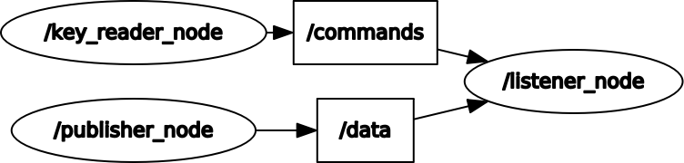

# Primo Homework di ROS (Robot Operating System)

## Specifiche del progetto 

Si realizzi un package ROS contenente degli opportuni nodi 
per poter svolgere i compiti seguenti

* Un nodo pubblica, 1 volta al secondo, un messaggio 
contenente un nome, una età, e un corso di laurea

* Un nodo permette di selezionare da tastiera quale parte 
del messaggio verrà mostrata a video (si veda la pagina 
seguente per i dettagli)

* Un nodo mostra a video la parte del messaggio 
selezionata

Il nodo che permette di selezionare da tastiera quale parte 
del messaggio mostrare dovrà comportarsi nel modo seguente:

* Digitando ‘a’ verrà stampato tutto il messaggio
* ‘n’ mostrerà solo il nome
* 'e’ mostrerà solo l’età
* ‘c’ mostrerà solo il corso di laurea

## Modalità di esecuzione

Per eseguire il package ros eseguire i seguenti punti:

* accedere alla workspace.
* clonare con git la repository nella cartella src presente nella workspace:
```
git clone https://github.com/NoeMurr/ros_homework_1.git
```

* eseguire i seguenti comandi:
```
catkin_make
roslaunch ros_homework_1 homework.launch 
```

## Scelte progettuali

### Struttura architetturale
Come suggerito dal docente il sistema prevede 3 nodi e 2 topic.



Come si può vedere dall'immagine il nodo publisher_node non è in grado 
di comunicare con il key_reader_node, ma entrambi comunicano tramite due 
topic diversi con il listener_node.

**N.B.** È stata fatta la scelta di non utilizzare messaggi personalizzati
per la comunicazione bensì di utilizzare un carattere per i comandi (come da specifiche) 
mentre per la pubblicazione di nome, età e corso di laurea è stata utilizzata
una semplice stringa.

### Scelte di programmazione
Per ottenere un codice elegante ma non esageratamente prolisso è stato 
creato un oggetto nel nodo listener_node che si occupa di _rispondere_
ad i messaggi in arrivo sui due topic. 

```c++
class Receiver {
	char m_mode = 'a';

	std::vector<std::string> tokenize(std::string s){
		using namespace std;
		istringstream iss(s);

		return {istream_iterator<string>{iss}, istream_iterator<string>{}};
	}

public:
	void commandCallback(const std_msgs::Char::ConstPtr &msg){
		switch (msg->data) {
		case 'a':
		case 'n':
		case 'e':
		case 'c':
			m_mode = msg->data;
			break;
		default:
			ROS_INFO("Unknown command '%c'", msg->data);
			m_mode = 'a';
		}
	}

	void dataCallback(const std_msgs::String::ConstPtr &msg){
		auto tokens = tokenize(msg->data);
		char idx = -1;
		switch(m_mode){
		case 'a':
			ROS_INFO("Received message: \"%s\"", msg->data.c_str());
			break;
		case 'n':
			idx = 0;
			break;
		case 'e':
			idx = 1;
			break;
		case 'c':
			idx = 2;
			break;
		}

		if (idx != -1) {
			try {
				ROS_INFO("Received data: \"%s\"", tokens.at(idx).c_str());
			} catch (std::out_of_range &e){
				ROS_INFO("BAD FORMATTED MESSEGE");
			}
		}
	}


};
```

Come si può vedere sfrutta una proprietà dell'oggetto 
memorizzare quale parte del messaggio visualizzare ed in 
base al valore contenuto in quella proprietà la callback 
adibita a ricevere i messaggi dal publisher_node mostra 
una determinata parte del messaggio. 

Si noti che la soluzione è pienamente scalabile ad ogni
situazione in cui si debbano visualizzare dei dati in 
arrivo da *n* nodi sulla base di *m* comandi inviati da
altri nodi. Basterà infatti aggiungere all'oggetto il 
giusto numero di callback ed il giusto numero di proprietà. 

Si deve anche aggiungere che questa soluzione, non avendo 
nessun tipo di mutex a proteggere la proprietà m_mode, è 
stata pensata per un uso mono-thread e non è thread safe.
è perciò doveroso utilizzare la funzione ros::spin() e non 
altre sue versioni multithread in modo che tutte le callback
vengano chiamate da un solo thread. 
